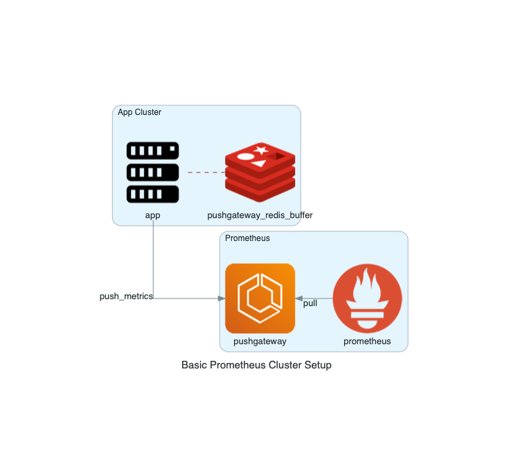
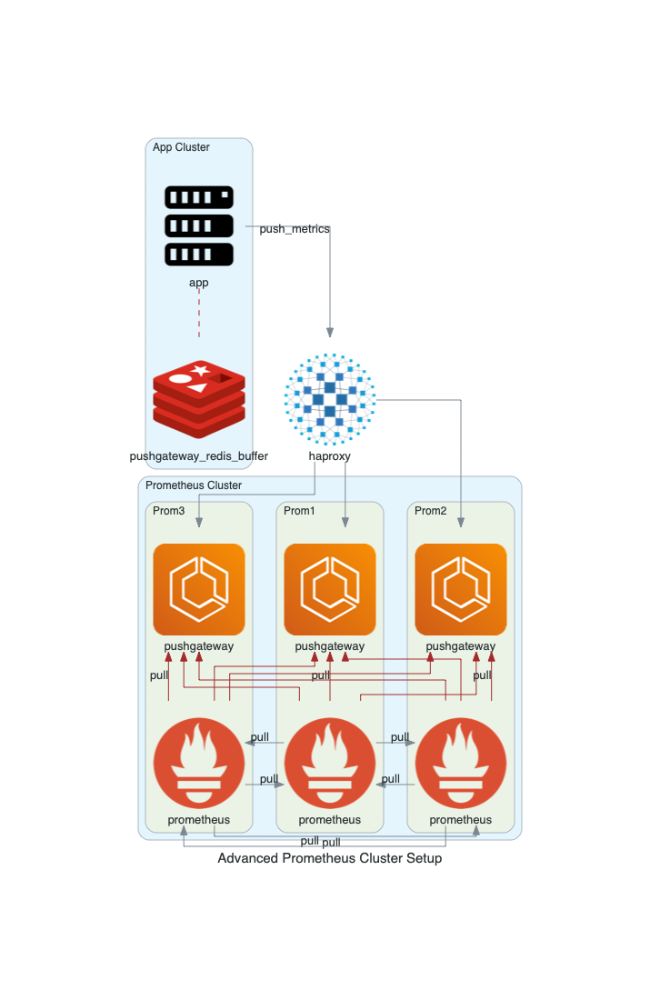

# PrometheusPushGatewayBundle

## Symfony Prometheus + PushGateway integration

Send metrics to Prometheus. +High Availability Setup 

## Requirements

1. `Redis` (the service & the PHP extension): to act as a buffer before push and avoid latency in the code, and as a store for the current counter values. 

2. `bin/console comsave:prometheus:push` cronjob: to push data periodically to Prometheus Pushgateway

## Configuration

In your `services.yml` add:

```yaml
comsave_prometheus_pushgateway:
    prometheus:
        host: 'prometheus:9090'
        username: 'admin' # optional
        password: 'duuude' # optional
        instance: 'moms_basement:6666' # your server host/name/etc
        jobs: 
            - 'metric_job_name'
            - 'metric_job_name2'
    pushgateway:
        host: 'pushgateway:9191'
        username: 'admin2' # optional
        password: 'duuude2' # optional
        redis: 'redis:6379'
```

Add the bundle to your Symfony kernel.
```php
new Comsave\PrometheusPushGatewayBundle\ComsavePrometheusPushGatewayBundle(),
```

## How does it work?

### Single Node Prometheus + Pushgateway

Single node is pretty straightforward. 

1. Use `PushGatewayClient` to create a metric. Metric is stored in `Redis`.
2. Use `PushGatewayClient` can be pushed manually or with a command. After push metrics stored in Redis are transported to the actual `PushGateway` service.
3. `Prometheus` periodically pulls in new metrics from `PushGateway`.



### Multi-Node Prometheus + Pushgateway Cluster

Multi-node set up works with the basics described above, with a couple exceptions:

1. There's an `Haproxy` (or other load balancer) that decides which `PushGateway` will receive the `push`.
2. Each `Prometheus` pulls from every `PushGateway` in every node. That way each `Prometheus` has the latest metrics.
3. Each `Prometheus` pulls (federates) from other `Prometheus` nodes (all but itself) though less often. This ensures data integrity (sort of replication).



## Development

Start single node `docker-compose up -d`

Or multi node     `docker-compose up -f docker-compose.multi-node.yml -d`

Tests `docker exec $(docker ps | grep _php | awk '{print $1}') vendor/bin/phpunit tests`

## License

MIT
